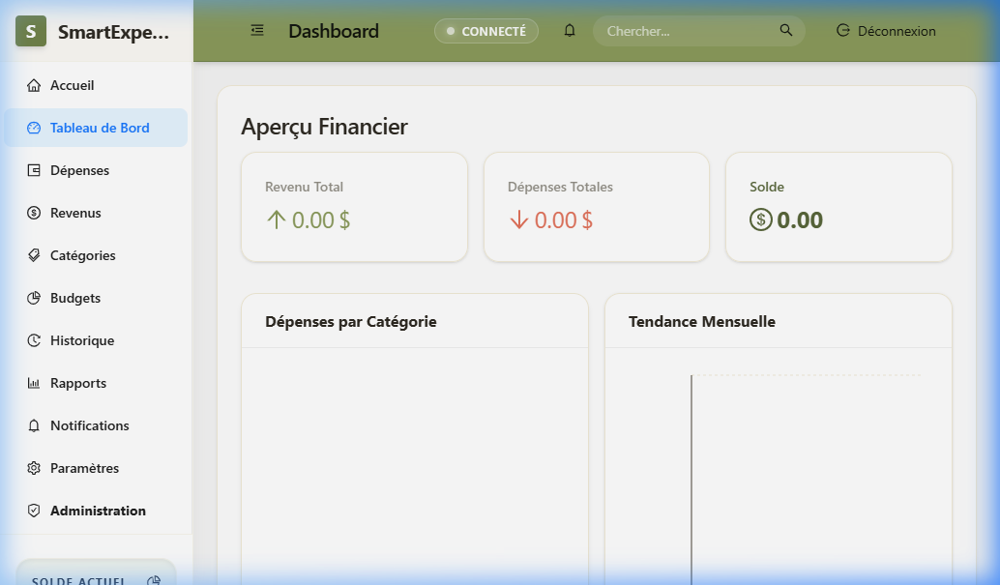
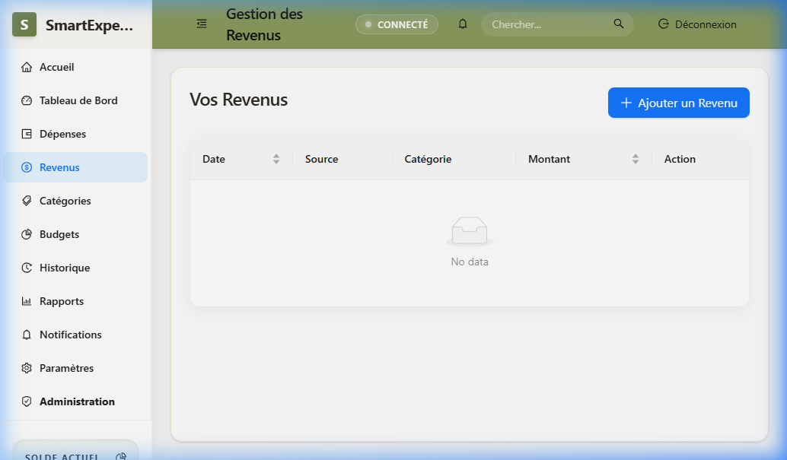
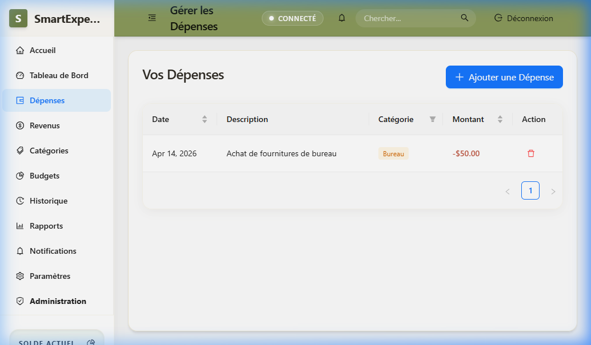
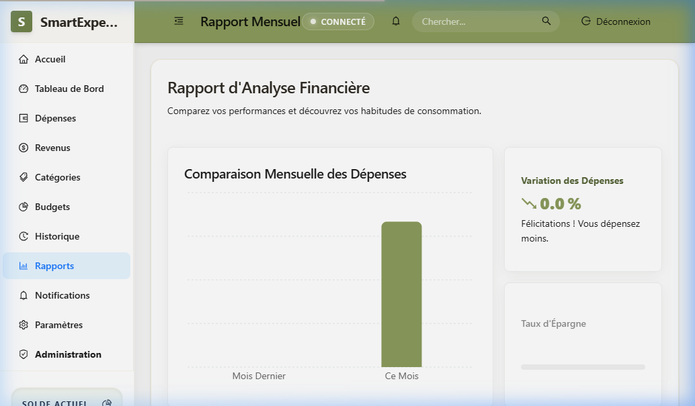

# SmartExpenseManager 💰

> Une application web professionnelle et sécurisée de gestion financière personnelle, développée avec **Laravel 12** et **React 19** (Inertia.js).

---

## 📽️ Démonstration Vidéo
Découvrez l'application en action : une interface fluide pour gérer vos finances, vos budgets et superviser les utilisateurs en tant qu'administrateur.


---

## 🎨 Aperçu de l'Interface (Design Premium)
L'interface intègre un design **Universal Earthy** avec un confort visuel optimal et des micro-animations interactives.

| 🏠 Tableau de Bord (Dashboard) | 💰 Gestion des Revenus |
|:---:|:---:|
|  |  |

| 💸 Gestion des Dépenses | 📑 Rapports & Statistiques |
|:---:|:---:|
|  |  |

---

## 🔑 Identifiants de Test (Mode Démo)

| Rôle | Nom / Identifiant | Email | Code PIN Admin |
|------|-------------------|-------|---------------|
| **Administrateur** | `farah ghilan` | *n'importe lequel* | `1234` |
| **Utilisateur** | *n'importe quel nom* | *n'importe lequel* | — |

---

## 🛡️ Fonctionnalités Clés
L'application regroupe l'ensemble des outils nécessaires à une gestion financière rigoureuse, répartis selon les rôles.

### 🏠 Espace Utilisateur (Gestion Personnelle)
- **Tableau de Bord Dynamique** : Vue d'ensemble en temps réel (Solde net, revenus totaux, dépenses totales) avec graphiques circulaires et temporels.
- **Gestion des Flux** : Ajout simplifié de revenus et dépenses avec catégorisation automatique.
- **Système de Budgétisation** : Définition de plafonds par catégorie avec **barres de progression visuelles** et alertes intelligentes.
- **Notifications en Temps Réel** : Alertes automatiques dès qu'un budget est dépassé ou qu'une limite de dépense est atteinte.
- **Rapports Avancés** : Analyse comparative entre le mois actuel et le précédent, incluant un **Financial Coach** (conseils personnalisés).

### 🛡️ Espace Administrateur (Supervision)
- **Sécurité Multi-Couches** : Accès au panneau d'administration protégé par un **Code PIN secret** additionnel.
- **Statistiques Globales** : Vue d'ensemble sur l'activité de la plateforme (Nombre d'utilisateurs, volume global des transactions).
- **Gestion des Comptes** : Contrôle total sur les utilisateurs inscrits (Attribution des rôles Admin/User, suppression sécurisée).

---

## ⚙️ Détails Techniques & Sécurité
- **Multi-Guards** : Barrières d'authentification Laravel (Middlewares) séparant strictement les sessions.
- **Protection des Données** : Mots de passe hachés (Bcrypt) et protection native contre les failles CSRF.
- **Mobilité des Données** : Exports disponibles en formats **CSV (Excel)** et **PDF stylisé** directement via le navigateur.
- **Stack Moderne** : Utilisation de **TailwindCSS 4**, **Ant Design 6** et **Recharts** pour une UI/UX d'exception.

---

## 🚀 Installation

### 🏗️ Étapes Rapidement
```bash
# 1. Cloner le dépôt
git clone https://github.com/farahgh12/SmartExpenseManager.git

# 2. Installer les dépendances
composer install
npm install

# 3. Configuration & Base de données
cp .env.example .env
php artisan key:generate
php artisan migrate:fresh --seed
php artisan seed:notifications

# 4. Lancer les serveurs
php artisan serve
npm run dev
```

---

## 👤 Auteur

**Farah Ghilan**  
Institut Spécialisé en Nouvelles Technologies de l'Information et de la Communication — SAFI  
OFPPT | Année 2025–2026

---
*Développé dans le cadre d'un projet de fin de formation.*
